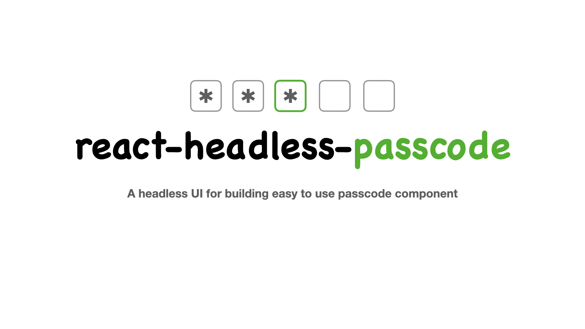

# react-headless-otp

A headless UI for building easy to use OTP component.

*What is an OTP component?*
It is a group of input elements with each element only accepting one character. This component is generally used in authentication flows.

* [Installation](#installation)
* [Usage](#usage)
* [Features](#features)
* [API](#api)
* [License](#license)

## Installation

```shell
yarn add react-headless-otp
```


## Usage

```tsx
import { useOtp } from "react-headless-otp";
```

With the `useOtp` hook you just need to pass the `arrayValue` default property and in return you get the `array` in which the actual otp value is stored, various event hanlders that handles the focus management between multiple inputs and `refs` that references each input element.

For example:

```tsx
const OTPComponent = () => {
  const { array, getEventHandlers, refs } = useOtp({
    arrayValue: [0, 0, 0, 0, 0, 0],
  });

  return (
    <>
      {array.map((value, index) => {
        const { ...rest } = getEventHandlers(index);
        return (
          <input
            className="single-input"
            ref={(el) => el && (refs.current[index] = el)}
            type="text"
            inputMode="numeric"
            autoComplete="one-time-code"
            maxLength={1}
            pattern="\d{1}"
            value={String(value)}
            key={`index-${index}`}
            {...rest}
          />
        );
      })}
    </>
  );
};

```

>**NOTE:**
> It is important to initialize the `refs` object with the current input element because this is how the `useOtp` is able to track the current index and manage the focused state across multiple inputs. Make sure to assign this element to the `refs` or else the focus won't change!!
```tsx
ref={(el) => el && (refs.current[index] = el)}
```

## Features
- Allow entering alpha numeric characters
- Expose a flag: `isComplete` that tells whether all the input boxes are filled or not
- Expose a state variable: `currentFocusedIndex`. It tells us the currently focused index of the OTP component.
- Exposes event handlers that can be seamlessly used with the input element.
- OTP value can be pasted partially, fully, from start, or from middle.

## API

The `useOtp` hook accepts following props
| Prop Name      	| Type                   	| Description                                                           	|
|----------------	|------------------------	|-----------------------------------------------------------------------	|
| arrayValue     	| `(number \| string)[]` 	| Default array value that helps to determine the size of the component 	|
| isAlphaNumeric 	| `boolean`       	| If `true`, allows to enter alpha numeric value in the component       	|

The hook returns an object that consists of:

| Property               	| Type                   	| Description                                                                                                                                                                        	|
|------------------------	|------------------------	|------------------------------------------------------------------------------------------------------------------------------------------------------------------------------------	|
| array                  	| `(string \| number)[]` 	| The current array value of the entire component.                                                                                                                                   	|
| setArray               	| `function`             	| A function that sets the internal state variable:`array`'s value inside the hook.                                                                                                  	|
| currentFocusedIndex    	|     `number`                   	| Index of the currently focused input element.                                                                                                                                      	|
| setCurrentFocusedIndex 	|       `function`                 	| A function that sets the internal state variable: `currentFocusedIndex`'s value inside the hook.                                                                                   	|
| getEventHandler        	|         `function`               	| A function that accepts an index as a parameter. It returns the following event handlers for the input positioned at index `i`: `onChange` `onFocus` `onKeyUp` `onKeyDown` 	|
| refs                   	|            `React.MutableRefObject<HTMLInputElement[] \| []>`            	| A ref array that contains reference of all the input boxes.                                                                                                                        	|
| isComplete             	|         `boolean`               	| A boolean flag that tells if all the input boxes are filled or not.                                                                                                                	|

## License
React is [MIT licensed](./LICENSE).